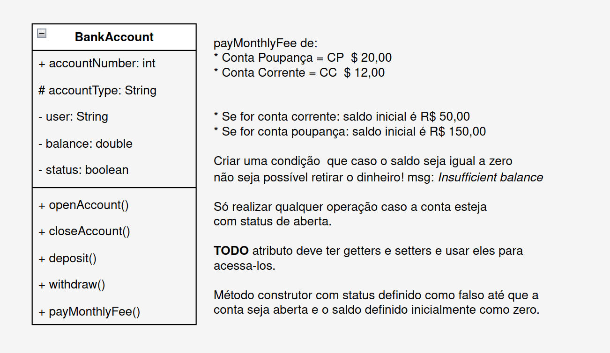

# BankAccount Project

This project is part of my 100-day programming challenge, where I am reviewing and applying Object-Oriented
Programming (OOP) concepts in Java. In this project, I created a class called `BankAccount` that simulates the behavior
of a bank account, allowing operations such as account opening, deposits, withdrawals, monthly fee payments, and account
closure.

## BankAccount Class Features

The `BankAccount` class includes the following attributes and methods:

### Attributes:

- `accountNumber` (int): Account number.
- `accountType` (String): Account type (savings or checking).
- `user` (String): Account holder's name.
- `balance` (double): Account balance.
- `status` (boolean): Indicates whether the account is active or inactive.

### Methods:

- `openAccount()`: Opens the account and adds an initial balance depending on the account type (checking or savings).
- `closeAccount()`: Closes the account.
- `deposit(double amount)`: Deposits an amount into the account.
- `withdraw(double amount)`: Withdraws an amount from the account.
- `payMonthlyFee()`: Deducts the monthly fee from the account, varying according to the account type.
- `accountStatus()`: Displays the current account status, including number, type, holder, and balance.

## Project Structure

The project is organized into two packages:

- `bank.domain`: Contains the `BankAccount` class, which implements the bank account logic.
- `bank.test`: Contains the `BankAccountTest` class, which runs tests to validate the functionality of the `BankAccount`
  class.

## Class Diagram

## What I Learned

This project was a great opportunity to apply the fundamental OOP concepts, such as:

- Creating and managing objects in Java.
- Data encapsulation using getters and setters.
- Use of access modifiers (`public`, `private`, `protected`).
- The importance of class cohesion, keeping responsibilities well-defined.